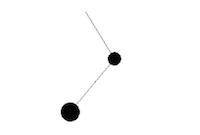

二重振り子シミュレーション
==========================



```
app
├── Constants.hs       -- 定数がまとまっているファイル
├── Main.hs            -- エントリポイント
└── View.hs            -- 描画関連のデータ構造と関数
src
├── DoublePendulum.hs  -- 二重振り子のデータ構造と運動方程式
└── RungeKutta.hs      -- ルンゲクッタ法
```

使い方
------

```shell
$ git clone git@github.com:lotz84/double-pendulum-simulation.git
$ cd double-pendulum-simulation

$ stack build
$ stack exec double-pendulum-simulation-exe
```

定数を変更したい場合は `app/Constants.hs` を修正して下さい

